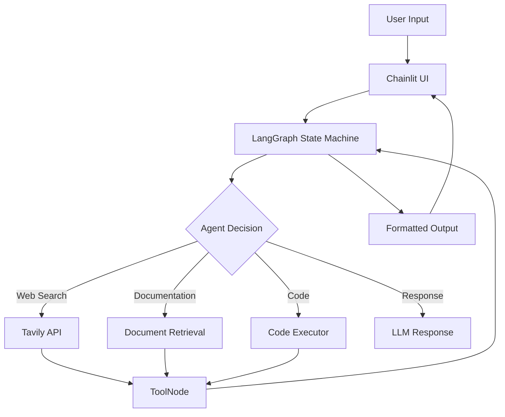

# 🤖 Ready Tensor Agentic AI Certification Chatbot

An intelligent, multi-tool chatbot built with LangGraph, LangChain, and Chainlit for the Ready Tensor Agentic AI Developer Certification Program. Features real-time web search, document retrieval, code execution, and a beautiful conversational UI.

[](https://opensource.org/licenses/MIT)
[](https://www.python.org/downloads/)
[](https://langchain.com/)
[](https://chainlit.io/)

## 📋 Table of Contents

- [Features](#-features)
- [Architecture](#-architecture)
- [Prerequisites](#-prerequisites)
- [Installation](#-installation)
- [Configuration](#-configuration)
- [Usage](#-usage)
- [Project Structure](#-project-structure)
- [Tools & Capabilities](#-tools--capabilities)
- [Logging](#-logging)
- [Troubleshooting](#-troubleshooting)
- [Contributing](#-contributing)
- [License](#-license)
- [Acknowledgments](#-acknowledgments)

## ✨ Features

### Core Capabilities
- 🔍 **Real-time Web Search** - Powered by Tavily API with enhanced JSON parsing
- 📚 **Course Documentation Retrieval** - Instant access to course materials on RAG, LangGraph, security, etc.
- 💻 **Safe Code Execution** - Execute Python code snippets in a sandboxed environment
- 🎯 **LangGraph Workflow** - Stateful agent orchestration with conditional routing
- 💬 **Beautiful Chainlit UI** - Modern, responsive chat interface
- 📊 **Professional Logging** - Rotating file logs with configurable levels
- 🔒 **Security First** - Input validation, dangerous pattern detection, no hardcoded secrets

### Technical Highlights
- **LangGraph ToolNode Integration** - Proper tool calling with state management
- **Structured JSON Responses** - All tools return well-formatted dictionaries
- **Enhanced Error Handling** - Comprehensive exception handling with user-friendly messages
- **Session Management** - Conversation history and context preservation
- **Async Operations** - Non-blocking UI with async/await patterns

## 🏗️ Architecture



### Key Components

1. **LangGraph Workflow**
   - State management with `AgentState` TypedDict
   - Conditional routing based on tool requirements
   - ToolNode for centralized tool execution

2. **Tools Layer**
   - `web_search_tool` - Tavily-powered web search
   - `document_retrieval_tool` - Course documentation access
   - `code_executor_tool` - Sandboxed Python execution

3. **UI Layer**
   - Chainlit for conversational interface
   - Real-time message streaming
   - Session-based state management

## 🔧 Prerequisites

- **Python**: 3.8 or higher
- **API Keys**:
  - [Groq API Key](https://console.groq.com/) - For LLM inference
  - [Tavily API Key](https://tavily.com/) - For web search (optional but recommended)

## 📦 Installation

### 1. Clone the Repository

```bash
git clone https://github.com/yourusername/ready-tensor-chatbot.git
cd ready-tensor-chatbot
```

### 2. Create Virtual Environment

```bash
# Using venv
python -m venv venv

# Activate virtual environment
# On macOS/Linux:
source venv/bin/activate
# On Windows:
venv\Scripts\activate
```

### 3. Install Dependencies

```bash
pip install -r requirements.txt
```

## ⚙️ Configuration

### 1. Environment Variables

Copy the example environment file:

```bash
cp .env.example .env
```

Edit `.env` and add your API keys:

```env
# Required: Groq API Key for LLM
GROQ_API_KEY=your_groq_api_key_here

# Optional: Tavily API Key for web search
TAVILY_API_KEY=your_tavily_api_key_here
```

### 2. Get Your API Keys

#### Groq API Key (Required)
1. Visit [Groq Console](https://console.groq.com/)
2. Sign up or log in
3. Navigate to API Keys section
4. Create a new API key
5. Copy and paste into `.env`

#### Tavily API Key (Optional)
1. Visit [Tavily](https://tavily.com/)
2. Sign up for a free account
3. Get your API key from the dashboard
4. Copy and paste into `.env`

> **Note**: Without Tavily API key, web search functionality will be disabled, but the chatbot will still work for course questions and code execution.

## 🚀 Usage

### Start the Chatbot

```bash
chainlit run chatbot.py -w
```

The `-w` flag enables auto-reload on file changes during development.

### Access the UI

Open your browser and navigate to:
```
http://localhost:8000
```

### Example Queries

#### Web Search
```
"Search for recent developments in AI agents"
"What's the latest news about LangGraph?"
"Find current information on RAG systems"
```

#### Course Documentation
```
"Tell me about the RAG module"
"What is LangGraph?"
"Explain security best practices for LLM apps"
"What topics are covered in Module 3?"
```

#### Code Execution
```
"Execute this code:
```python
def fibonacci(n):
    if n <= 1:
        return n
    return fibonacci(n-1) + fibonacci(n-2)

print([fibonacci(i) for i in range(10)])
```
"
```

#### General Questions
```
"How do I enroll in the certification program?"
"What are the project requirements?"
"Tell me about the course structure"
```

### Special Commands

- Type `history` or `show history` to view recent conversation history

## 📁 Project Structure

```
ready-tensor-chatbot/
├── chatbot.py              # Main application file
├── .env.example            # Environment variables template
├── .env                    # Your environment variables (git-ignored)
├── .gitignore              # Git ignore rules
├── requirements.txt        # Python dependencies
├── LICENSE                 # MIT License
├── README.md              # This file
└── logs/                   # Log files directory (auto-created)
    └── chatbot_YYYYMMDD.log
```

## 🛠️ Tools & Capabilities

### 1. Web Search Tool
- **Provider**: Tavily API
- **Features**: 
  - Top 3 most relevant results
  - Includes quick answer when available
  - Source URLs and publication dates
  - Formatted markdown output
- **Output Format**:
  ```json
  {
    "status": "success",
    "query": "search query",
    "answer": "Quick answer summary",
    "results": [
      {
        "title": "Article Title",
        "url": "https://...",
        "content": "Article content...",
        "score": 0.95,
        "published_date": "2024-01-15"
      }
    ]
  }
  ```

### 2. Document Retrieval Tool
- **Source**: Built-in course knowledge base
- **Topics**: RAG, LangGraph, Vector Databases, Security, Deployment, Testing
- **Features**:
  - Module-specific filtering
  - Comprehensive technical documentation
  - Project descriptions
- **Output Format**:
  ```json
  {
    "status": "success",
    "topic": "langgraph",
    "documents": [
      {
        "topic": "langgraph",
        "module": "2",
        "title": "LangGraph (Multi-Agent Systems)",
        "content": "Documentation text..."
      }
    ]
  }
  ```

### 3. Code Executor Tool
- **Language**: Python 3.8+
- **Security**: Sandboxed execution environment
- **Restrictions**: 
  - No file system access
  - No network operations
  - No dangerous imports (os, sys, subprocess)
- **Allowed Operations**: Math, data structures, algorithms
- **Output Format**:
  ```json
  {
    "status": "success",
    "message": "Code executed successfully",
    "output": "Program output...",
    "code": "original code"
  }
  ```

## 📝 Logging

### Log Configuration

- **Location**: `logs/chatbot_YYYYMMDD.log`
- **Rotation**: 10MB max file size, 5 backup files
- **Levels**:
  - File: INFO and above
  - Console: WARNING and above

### Log Format

```
2024-01-15 10:30:45,123 - ready_tensor_chatbot - INFO - main:145 - Processing query: What is RAG?
```

### Viewing Logs

```bash
# View latest log
tail -f logs/chatbot_$(date +%Y%m%d).log

# Search for errors
grep ERROR logs/chatbot_*.log

# View specific session
grep "session_id" logs/chatbot_*.log
```

## 🐛 Troubleshooting

### Common Issues

#### 1. "GROQ_API_KEY not set"
**Solution**: Ensure `.env` file exists and contains valid Groq API key
```bash
cat .env | grep GROQ_API_KEY
```

#### 2. "Web search not working"
**Solution**: Check if Tavily API key is set and valid
```bash
cat .env | grep TAVILY_API_KEY
```

#### 3. "Module not found" errors
**Solution**: Reinstall dependencies
```bash
pip install -r requirements.txt --upgrade
```

#### 4. Port 8000 already in use
**Solution**: Use a different port
```bash
chainlit run chatbot.py -w --port 8001
```

#### 5. Chainlit UI not loading
**Solution**: 
- Clear browser cache
- Try incognito/private mode
- Check console for errors: `chainlit run chatbot.py -w --debug`

### Debug Mode

Enable debug logging:
```python
# In chatbot.py
logger.setLevel(logging.DEBUG)
```

### Getting Help

1. Check logs in `logs/` directory
2. Review error messages in the UI
3. Enable debug mode for verbose output
4. Open an issue on GitHub with:
   - Error message
   - Steps to reproduce
   - Log excerpts (sanitize API keys!)

## 🤝 Contributing

Contributions are welcome! Please follow these guidelines:

### Development Setup

1. Fork the repository
2. Create a feature branch: `git checkout -b feature/amazing-feature`
3. Make your changes
4. Run tests (if available)
5. Commit: `git commit -m 'Add amazing feature'`
6. Push: `git push origin feature/amazing-feature`
7. Open a Pull Request

### Code Style

- Follow PEP 8 guidelines
- Add docstrings to all functions
- Include type hints
- Write descriptive commit messages
- Update README for new features

### Areas for Contribution

- [ ] Add more course documentation
- [ ] Implement additional tools
- [ ] Improve error handling
- [ ] Add unit tests
- [ ] Enhance UI with custom components
- [ ] Add conversation export feature
- [ ] Implement RAG for custom documents

## 📄 License

This project is licensed under the MIT License - see the [LICENSE](LICENSE) file for details.

```
MIT License

Copyright (c) 2024

Permission is hereby granted, free of charge, to any person obtaining a copy
of this software and associated documentation files (the "Software"), to deal
in the Software without restriction, including without limitation the rights
to use, copy, modify, merge, publish, distribute, sublicense, and/or sell
copies of the Software, and to permit persons to whom the Software is
furnished to do so, subject to the following conditions:

The above copyright notice and this permission notice shall be included in all
copies or substantial portions of the Software.

THE SOFTWARE IS PROVIDED "AS IS", WITHOUT WARRANTY OF ANY KIND, EXPRESS OR
IMPLIED, INCLUDING BUT NOT LIMITED TO THE WARRANTIES OF MERCHANTABILITY,
FITNESS FOR A PARTICULAR PURPOSE AND NONINFRINGEMENT.
```

## 🙏 Acknowledgments

- **Ready Tensor** - For the excellent Agentic AI Developer Certification Program
- **LangChain Team** - For the powerful LangChain and LangGraph frameworks
- **Chainlit** - For the beautiful chat UI framework
- **Tavily** - For the reliable web search API
- **Groq** - For fast LLM inference

## 📚 Additional Resources

- [Ready Tensor Certification Program](https://readytensor.com)
- [LangChain Documentation](https://python.langchain.com/)
- [LangGraph Documentation](https://langchain-ai.github.io/langgraph/)
- [Chainlit Documentation](https://docs.chainlit.io/)
- [Groq Documentation](https://console.groq.com/docs)
- [Tavily API Documentation](https://docs.tavily.com/)

## 📧 Contact

For questions about the chatbot:
- Open an issue on GitHub
- Check the logs for debugging

For questions about the certification program:
- Visit [Ready Tensor](https://readytensor.com)
- Join the Discord community

---

**Built with ❤️ for the Ready Tensor Agentic AI Community**

*Last Updated: December 2024*
